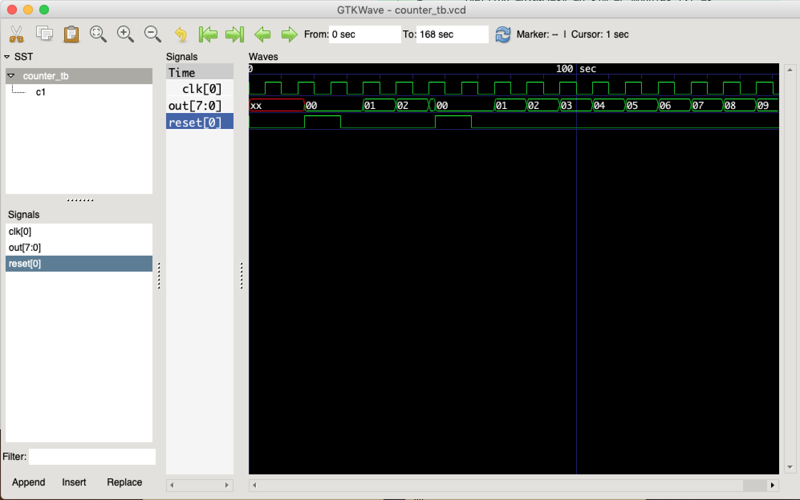

# EC3331_FPGA
Basic Verilog project to introduce FPGA programming

## Setup (MacOS)

### Icarus Verilog
First thing first, we need a Verilog simulation and synthesis tool. 
Icarus Verilog is the one that is free and the one that I worked with, but there are others!
```bash
brew install icarus-verilog
```

If you don't have `homebrew` you will need to get it first by running this script:
```bash
/bin/bash -c "$(curl -fsSL https://raw.githubusercontent.com/Homebrew/install/HEAD/install.sh)"
```

If you are not on MacOS, checkout this page for guidelines on installation:
https://iverilog.fandom.com/wiki/Installation_Guide


### GTKWave

Now that we have the simulator, we also need something to view our waveforms with. 
A free tool that I used is GTKWave. To install it on MacOS, just downlaod the zip directly and unzip:
```bash
curl http://gtkwave.sourceforge.net/gtkwave.zip --output gtkwave.zip
unzip gtkwave.zip
```

You can then copy gtkwave into your Applications folder for easy access, or anywhere else for that matter.
In this tutorial I'll execute gtkwave from the command line.

## Basic Simulation

1. Compiling the Verilog Source Code 
```bash
iverilog -o sim counter_tb.v counter.v
```
2. Running the Simulation
```bash
vvp sim -lxt2
```
3. Type "finish" to finish the simulation. 
```
LXT2 info: dumpfile counter_tb.vcd opened for output.
** VVP Stop(0) **
** Flushing output streams.
** Current simulation time is 168 ticks.
> finish
```
4. The output of the simulation is a waveform file. Open it using `gtkwave`!
```bash
./gtkwave.app/Contents/Resources/bin/gtkwave counter_tb.vcd 
```
5. Observe the simulation :) 



